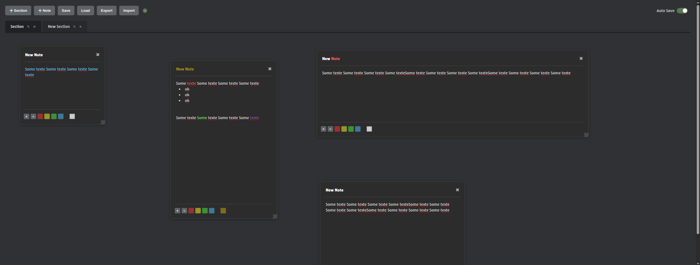

# Notes 
A minimalist and fast app for taking notes.

It was created to record information and gather data during pentests or bug bounty sessions. However, it can also be used in many other situations.

## Key Features:

- **Add Notes**: Create and manage notes easily and quickly.
- **Add Section**: Create and manage sections like browser tabs easily and quickly.
- **Drag and Drop**: Move and position notes freely, organizing them however you want.
- **Organize by Sections**: Divide notes into different sections for better organization.
- **Local Storage**: Save notes directly to your browser's local storage.
- **Auto Save**: Automatically save and load your content.
- **Export & Import**: Export notes as a JSON file and import them later when needed.
- **Bulleted Lists**: Create simple and clean bulleted lists to better structure your information.

 

