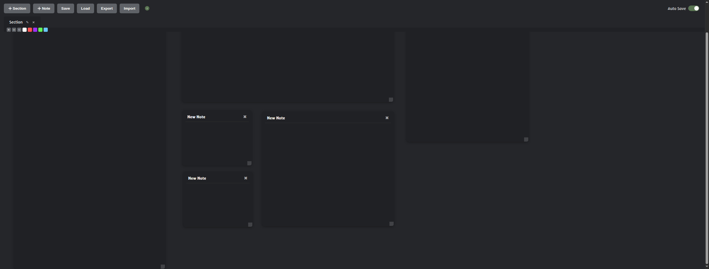
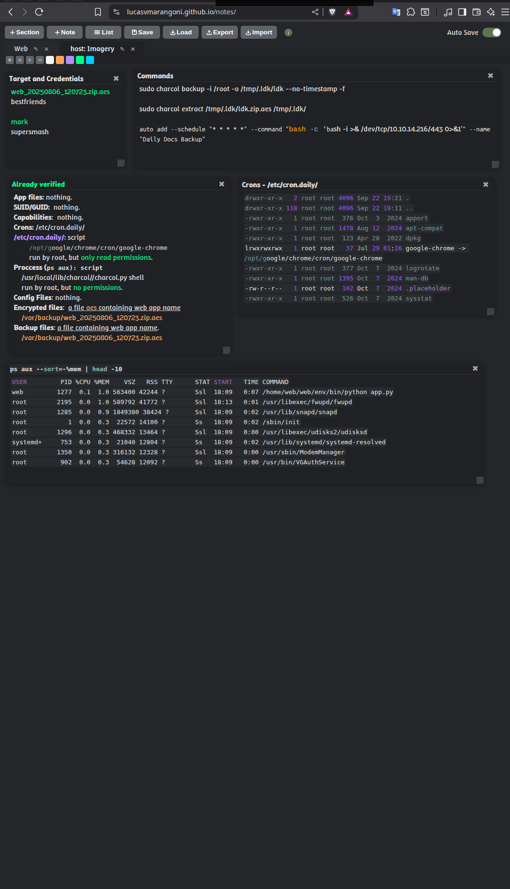

# Notes 
A minimalist and fast app for taking notes.

It was created to quickly and offiline record information and gather data during pentests or bug bounty sessions. However, it can also be used in many other situations.

## Key Features:

- **Add Notes**: Create and manage notes easily and quickly.
- **Add Section**: Create and manage sections like browser tabs.
- **List**: All sections and notes listed in a hierarchical and organized view.
- **Drag and Drop**: Move and position notes freely.
- **Bulleted Lists**: Type `*` + space at the start of a line, or select text and click the bullet (•) button to convert each line to a bullet point.
- **Numbered Lists**: Type `1.` + space at the start of a line, or select text and click the numbered (1.) button to convert each line to a numbered item.
- **Checkboxes**: Type `>` + space at the start of a line, or select text and click the checkbox (☐) button to convert each line to a checkbox.
- **List Conversion**: Select text and click the bullet (•), numbered (1.), or checkbox (☐) buttons in the toolbar to convert each line to the selected list type.
- **Organize by Sections**: Divide notes into different sections.
- **Local Storage**: Save notes to your browser's local storage.
- **Auto Save**: Automatically save and load your content.
- **Export & Import**: Export notes as JSON and import them later.
- **Event Storage**: Enables real-time synchronization between multiple windows.
- **Keyboard Shortcuts**:
    - **Ctrl + 1 to 4:** Apply one of the four predefined colors
    - **Ctrl + ':** Apply color-picker defined color
    - **Ctrl + B:** Toggle bold
    - **Ctrl + U:** Toggle underline
    - **Ctrl + \ :** Remove all formatting
    - **Ctrl + E:** Toggle to code formatting or remove code formatting
    - **Ctrl + Shift + Click:** Select and drag multiple notes simultaneously
    - **Enter:** In lists, creates a new item. Press Backspace on empty items to exit the list.
 

**Importing a usage example**: <a href="https://github.com/Lucasvmarangoni/notes/blob/main/example.json">example.json</a>

## 🪪 License

Copyright (c) 2025 Lucas Vazzoller Marangoni  
Licensed under [Creative Commons Attribution-NonCommercial 4.0 International (CC BY-NC 4.0)](https://creativecommons.org/licenses/by-nc/4.0/)  
See the [LICENSE](./LICENSE) file for more information.
