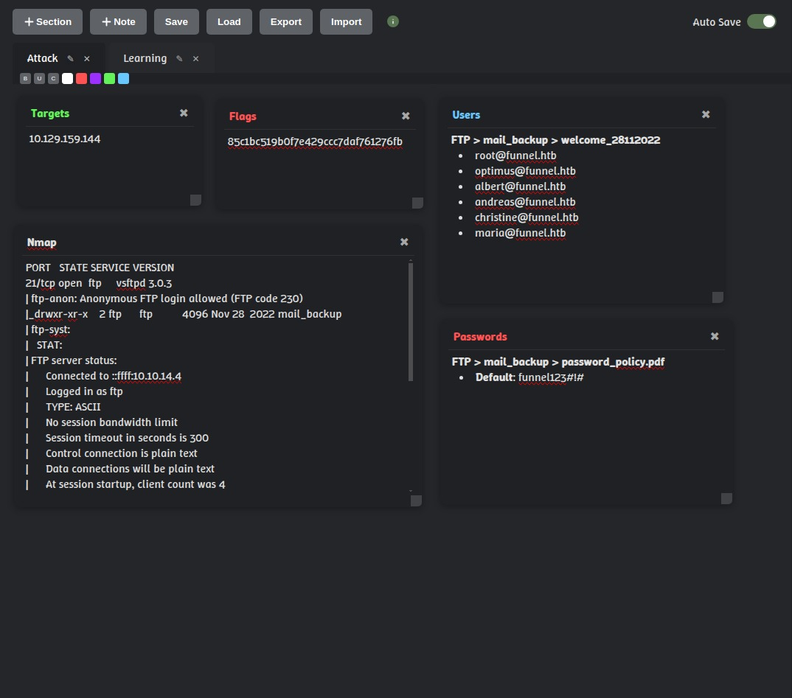
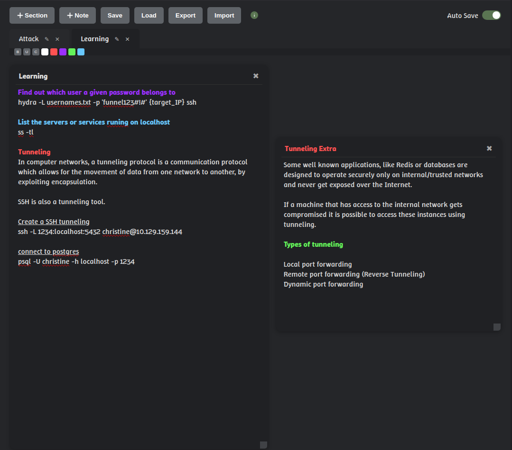

# Notes 
A minimalist and fast app for taking notes.

It was created to quickly and offiline record information and gather data during pentests or bug bounty sessions. However, it can also be used in many other situations.

## Key Features:

- **Add Notes**: Create and manage notes easily and quickly.
- **Add Section**: Create and manage sections like browser tabs.
- **List**: All sections and notes listed in a hierarchical and organized view.
- **Drag and Drop**: Move and position notes freely.
- **Bulleted Lists**: Create simple and clean bulleted lists.
- **Organize by Section**s: Divide notes into different sections.
- **Local Storage**: Save notes to your browser's local storage.
- **Auto Save**: Automatically save and load your content.
- **Export & Import**: Export notes as JSON and import them later.
- **Event Storage**: Enables real-time synchronization between multiple windows.
- **Keyboard Shortcuts**:
    - **Ctrl + 1 to 4:** Apply one of the four predefined colors
    - **Ctrl + ':** Apply color-picker defined color
    - **Ctrl + B:** Toggle bold
    - **Ctrl + U:** Toggle underline
    - **Ctrl + \ :** Remove all formatting
    - **Ctrl + F:** Toggle to code formatting
 

